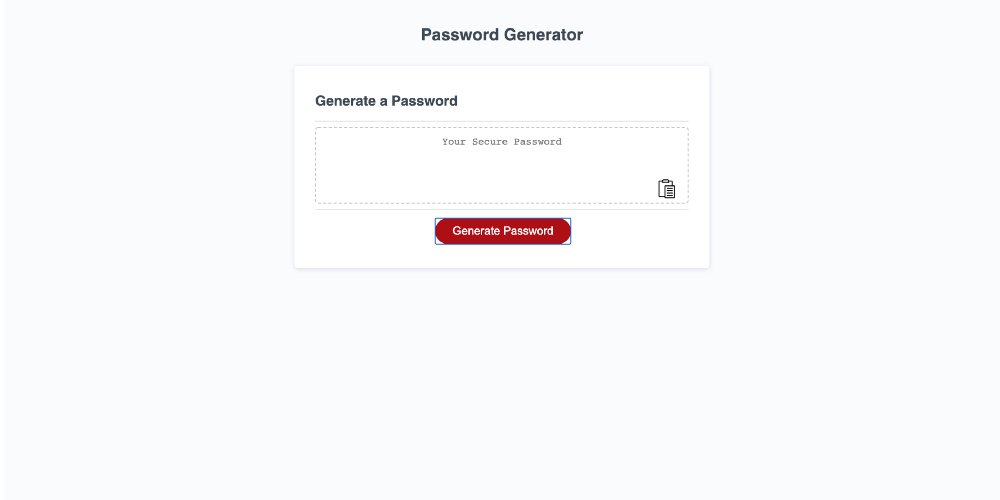
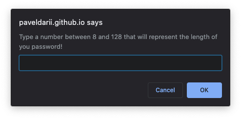
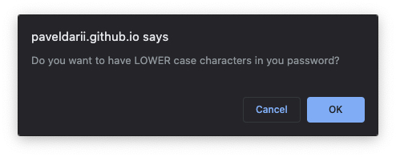
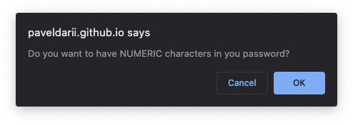
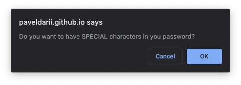

# password-generator

## Description
The password generator site is made with the purpose to generate a random password, that will depend on User preferences regarding length, lower case characters, upper case characters, numeric characters, or special characters.

The first step in using the generator is to push the button Generate Password
\\\
Then, select the length of the password.
\
Next, user should answer to four prompt messages.
\
\
\
\

After the password is generated, in the right bottom corner is an icon which can be pushed to copy the password to the clipboard.

Last step is to use the password.

## Purpose and motivation

The motivation behind this project was to make a password generator that will provide a strong random password which will be very secure. The logic behind it consists from several steps. As a first step I made four functions which returns randomly four types of characters as described above. Then, I added those functions in a list dependig if the user selected them or not. Next step, depending on how long user chose to be the password I made a for loop that will go randomly to the list from previous step, and on each loop will  select characters, which eventually will be added to a string variable. The content from that string variable is returned in the textarea which, finally, is displayed on the screen.

## Deployed link of the site
[password-generator](https://paveldarii.github.io/password-generator)

## Copyright

2020 Pavel Darii
